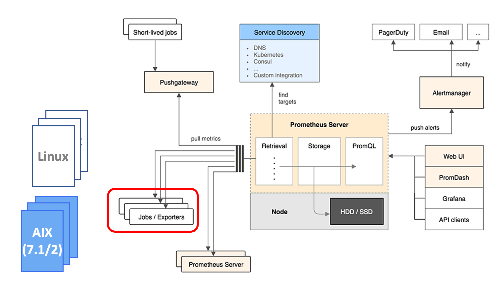
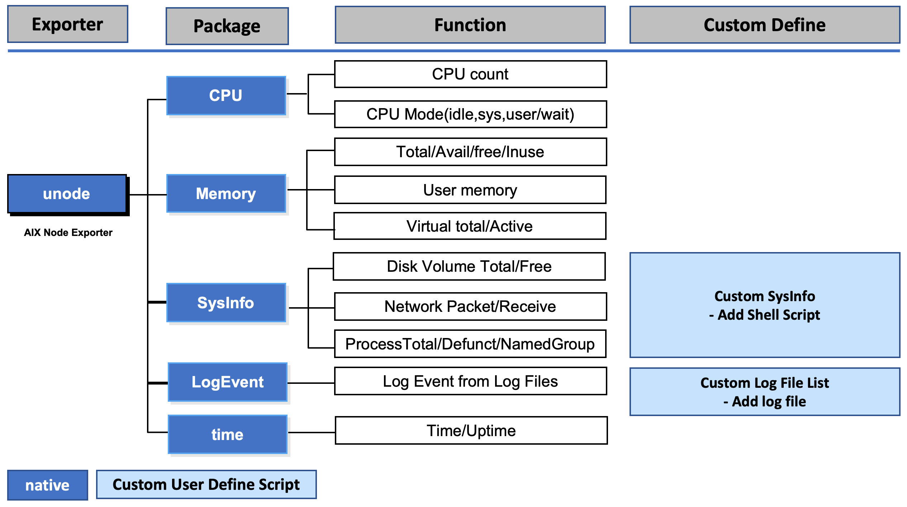
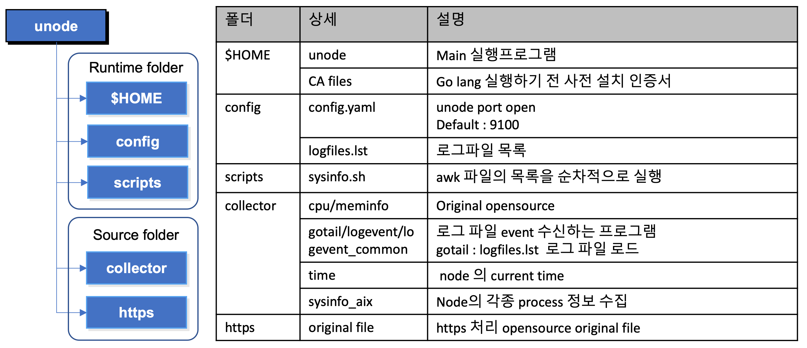
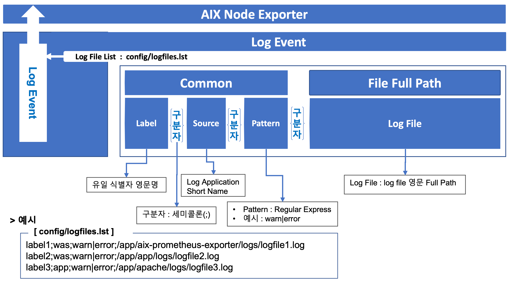
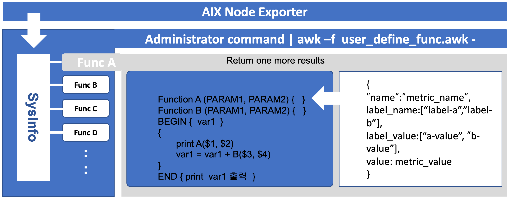
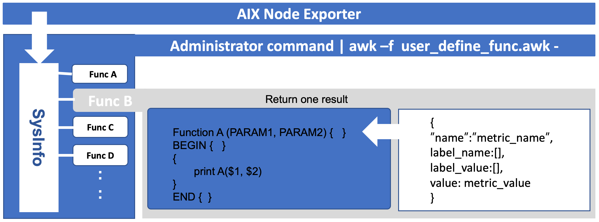

# AIX Prometheus Exporter

This is a node exporter for AIX.

Tested with `AIX 7.1/7.2` on `IBM POWER 7` and Added functions using shell script



Collectors:

* cpu
* logevent
* memory
* sysinfo
* time

## 1. Pre-requisites
Runtime Env : AIX aix7.1/7.2 
* go version 1.12.2 gcc 9.1.0 aix/ppc64
* git version 2.20.1

* Setup git configuration
```
git config --global http.sslVerify false
git https validate off
git config --global user.name "Kildong Hong"
```

* Generation Certification file
```
openssl genrsa -out rootCA.key 2048 
openssl req -x509 -new -nodes -key rootCA.key -subj "/CN=*.tonybai.com" -days 5000 -out rootCA.pem 
openssl genrsa -out cert.key 2048 
openssl req -new -key cert.key -subj "/CN=tonybai.com" -out cert.csr 
openssl x509 -req -in cert.csr -CA rootCA.pem -CAkey rootCA.key -CAcreateserial -out cert.crt -days 5000
```


* Download library using go packages
```
go get -u -v -insecure  gopkg.in/check.v1
go get -u -v -insecure  golang.org/x/sys
go get -u -v -insecure  golang.org/x/net
go get -v -u -insecure  gopkg.in/alecthomas/kingpin.v2
go get -v -u -insecure  gopkg.in/yaml.v2 v2.2.8
go get -v -u -insecure  github.com/pkg/errors v0.8.1
go get -v -u -insecure  github.com/prometheus/client_golang v1.0.0
go get -v -u -insecure  github.com/prometheus/common v0.7.0
```
## 2. Unode Exporter on AIX 
* Functional List


* Directory Environment


* config.yaml
```
unode:
    port: 9100
```

* config/logfiles.lst


```
metric_label1;was;warn|error;/app/aix-prometheus-exporter/logs/logfile1.log
metric_label2;was;warn|error;/app/app/logs/logfile2.log
metric_label3;app;warn|error;/app/apache/logs/logfile3.log
```

* scripts/sysinfo.sh

```
# start shell
echo "[”


# Add the last script have a comma in result
ps -ef| grep defunct | wc -l | awk -f ./scripts/func-a.awk –
ps -ef| grep defunct | wc -l | awk -f ./scripts/func-b.awk –
:

# end shell
echo "]"
```

* scripts/func-a.awk

```
# sub function
function disk_volume_size(FS_NAME, MNT_POINT, BLOCK_SIZE)
{
  line="{\"name\": \"disk_volume_size\", \"label_name\": [\"filesystem\", \"mount\", \"unit\"],\"label_value\": [\""FS_NAME"\",\""MNT_POINT"\", \"MB blocks\"], \"value\": "BLOCK_SIZE"},"
  return line
}

# sub2 function
function disk_volume_freesize(FS_NAME, MNT_POINT, BLOCK_SIZE)
{
  line="{\"name\": \"disk_mount_volumn_freesize\", \"label_name\": [ \"filesystem\",\"mount\", \"unit\"],\"label_value\":[\""FS_NAME"\",\""MNT_POINT"\",\"MB blocks\"], \"value\":"BLOCK_SIZE"},"
  return line
}

BEGIN { i = 0; freesize = "" }
# main routine
{
  # I == 0, skipped first line title
  if (i++ > 0) {
    print disk_volume_size($1, $7, format($2))
    freesize = freesize "" disk_volume_freesize($1, $7, $3) "\n"
  }
}

# second grouping Label
END {
  print substr(freesize, 0, length(freesize) - 1)
}

```

* scripts/func-b.awk

```
# return one result
function node_procs_running(LABEL_VALUE) {
  line="{\"name\": \”USER_DEFINE_LABEL_NAME\", \"label_name\": [],\"label_value\": [], \"valu
e\": "LABEL_VALUE"},"
  return line
}
BEGIN { i = 0; freesize = "" }
# main routine
{
    print node_procs_running($1)
}
END {
}:

```

## 3. Build/Run/Test Unode Exporter on AIX 
* Build
```
go build -o unode exporter.go
```

* Run
```
./unode
```

* Test
```
curl http://localhost:9100/metrics
```

* Change unode port
Modify port number in config/config.yaml , and run unode runtime module.
